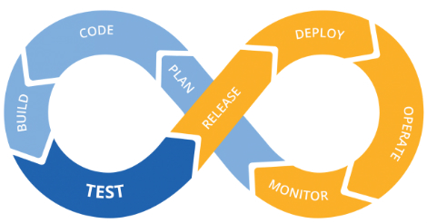

# **Kubernetes com piloto automático na Google Cloud**

Anderson Bispo

---

<!-- _paginate: false -->

#### 🇧🇷 

* Servidor Público do TJBA
* ConsTrutor 4Linux
* 21 de experiência em TI 💻
* Graduado em SI 💻
* Especialista em Gestão de TI e MBA em DW/BI 💻
* HashiCorp Certified: Terraform Associate
* Google Cloud Certified Professional Cloud Architect
* AWS Solutions Architect Associate
* Oracle Cloud Infrastructure Certified Architect Professional
* PSMI- Professional Scrum Master I

Contato: [https://www.linkedin.com/in/andersonbispos/](https://www.linkedin.com/in/andersonbispos/)

---

---

#### DevOps Cloud Native na Google Cloud

* Code (Cloud Source Repository)
* Build (Cloud Build)
* Release (Artifact Registy)
* Deploy (Cloud Build)
* Monitor (Cloud Operations)
* Operate
    * VMs (Compute Engine + Docker)
    * Google Kubernetes Engine (GKE) 
    * Server Less (App Engine/Cloud Run)
---

---