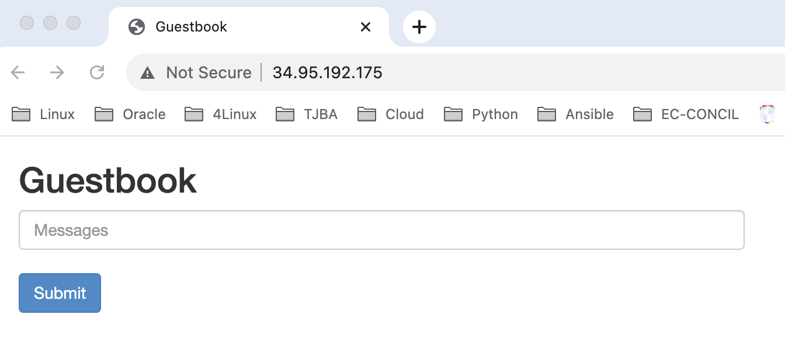

# Kubernetes Day 4Linux

1. [Kubernetes com piloto automático na Google Cloud](https://github.com/andersonbispos/4Linux-k8s-day/blob/main/tutorial/README.md#Kubernetes-com-piloto-automático-na-Google-Cloud "Kubernetes com piloto automático na Google Cloud")
1. [Configurando o Projeto](https://github.com/andersonbispos/4Linux-k8s-day/blob/main/tutorial/README.md#Configurando-o-Projeto "Configurando o Projeto")
1. [Implantando o livro de visitas com Redis e PHP](https://github.com/andersonbispos/4Linux-k8s-day/blob/main/tutorial/README.md#Implantando-o-livro-de-visitas-com-Redis-e-PHP "Implantando o livro de visitas com Redis e PHP")
   1. [Configurar o líder do Redis Redis](https://github.com/andersonbispos/4Linux-k8s-day/blob/main/tutorial/README.md#Configurar-o-líder-do-Redis-Redis "Implantando o livro de visitas com Redis e PHP")
   1. [Configurar seguidores do Redis](https://github.com/andersonbispos/4Linux-k8s-day/blob/main/tutorial/README.md#Configurar-seguidores-do-Redis "Configurar seguidores do Redis")
   1. [Configurar o front-end da Web do livro de visitas](https://github.com/andersonbispos/4Linux-k8s-day/blob/main/tutorial/README.md#Configurar-o-front-end-da-Web-do-livro-de-visitas "Configurar o front-end da Web do livro de visitas")
   1. [Testar o livro de visitas](https://github.com/andersonbispos/4Linux-k8s-day/blob/main/tutorial/README.md#Testar-o-livro-de-visitas "Testar o livro de visitas")
   1. [Criar uma configuração de HPA para o front-end WEB](https://github.com/andersonbispos/4Linux-k8s-day/blob/main/tutorial/README.md#Criar-uma-configuração-de-HPA-para-o-front-end-WEB "Criar uma configuração de HPA para o front-end WEB")

## Kubernetes com piloto automático na Google Cloud

O Autopilot do GKE é um modo de operação no GKE em que o Google gerencia a configuração do cluster, incluindo nós, escalonamento, segurança e outras configurações prévias. Os clusters do Autopilot são otimizados para executar a maioria das cargas de trabalho de produção e provisionar recursos de computação com base nos manifestos do Kubernetes. A configuração simplificada segue as práticas recomendadas e recomendações do GKE para configuração, escalonabilidade e segurança do cluster e da carga de trabalho.

O Google Cloud disponibiliza vários exemplos de aplicações e cargas de trabalho diversas que podem ser utilizadas para realizar testes de aplicação no GKE.

Para esse tutorial vamos utilizar o tutorial disponibilizado em [Tutorial GKE - Redis/PHP](https://cloud.google.com/kubernetes-engine/docs/tutorials/guestbook) com algumas adaptações.

Mais exemplos de cargas de trabalho para testes no GKE podem ser encontrados [aqui](https://cloud.google.com/kubernetes-engine/docs/samples) e [aqui](https://github.com/GoogleCloudPlatform/kubernetes-engine-samples)

### Conceitos Importantes:

- [Cluster AutoScaling](https://cloud.google.com/kubernetes-engine/docs/concepts/cluster-autoscaler?hl=pt-br) e [Horizontal Pod Autoscaling](https://kubernetes.io/docs/tasks/run-application/horizontal-pod-autoscale/)
- [Configuração Declarativa](https://kubernetes.io/docs/tasks/manage-kubernetes-objects/declarative-config) usando arquivos de manifestos YAML.
- [Deployments](https://kubernetes.io/docs/concepts/workloads/controllers/deployment), que são recursos do Kubernetes que determinam a configuração de um conjunto de pods replicados (links em inglês)
- [Services](https://kubernetes.io/docs/concepts/services-networking/service), para criar balanceadores de cargas internos e externos em um conjunto de pods.

### Objetivos:

Para implantar e executar o aplicativo de livro de visitas no GKE Auto Pilot:

1. Criar um cluster GKE Auto Pilot
1. Configurar o líder do Redis
1. Configurar dois seguidores do Redis
1. Configurar o front-end da Web do livro de visitas
1. Acesse o site do livro de visitas.
1. Amplie o front-end da Web do livro de visitas.
1. Configure o HPA para o front-end do livro de visitas.

Abaixo um exemplo da arquitetura do nosso exemplo:


## Configurando o Projeto

Você pode usar um projeto existente do Google Cloud Platform para este tutorial ou pode [criar um projeto](https://cloud.google.com/resource-manager/docs/creating-managing-projects#creating_a_project).

Abra o <walkthrough-editor-spotlight spotlightId="menu-terminal">terminal</walkthrough-editor-spotlight> e siga os passos abaixo:

### 1. Configure as variáveis de ambiente

No terminal, defina duas variáveis `PROJECT_ID` e `COMPUTE_ZONE`, caso ainda não as tenha configurado.

```bash
PROJECT_ID=meu-projeto
```
Substitua `meu-projeto` pelo seu [project id](https://support.google.com/cloud/answer/6158840).

```bash
COMPUTE_ZONE=soutamerica-east1-c
```
Substitua COMPUTE_ZONE pela zona onde você quer provisinar os recursos [compute zone](https://cloud.google.com/compute/docs/regions-zones#available), por exemplo: `soutamerica-east1-c`.

### 2. Defina o projeto e a zona padrão
```bash
gcloud config set project $PROJECT_ID
gcloud config set compute/zone $COMPUTE_ZONE
```

### 3. Ajuste a configuração de exibição dos outputs dos comandos

```bash
gcloud config set accessibility/screen_reader False
```

### 4. Habilite as APIs necessárias:

```bash
gcloud services enable container.googleapis.com
gcloud services enable artifactregistry.googleapis.com
```

Em seguida, vamos criar nosso cluster do GKE Auto Pilot.


## Criando um Cluster GKE Auto Pilot

Um cluster GKE consiste em pelo menos uma máquina de plano de controle de cluster e várias máquinas de trabalho chamadas nós. Os nós são [instâncias de máquina virtual (VM) do Compute Engine](https://cloud.google.com/compute/docs/instances) que executam os processos do Kubernetes necessários para torná-los parte do cluster.

No GKE AutoPilot toda a infraestrutura subjacente ao cluster Kubernetes é gerenciado pela Google Cloud. Você só precisa se preocupar em criar os arquivos de declaração do K8S e fazer a implantação da sua aplicação. Toda infra é gerenciada pelo google. Além disso você só paga pela CPU, pela memória e pelo armazenamento que as cargas de trabalho solicitarem enquanto são executadas no Autopilot do GKE Você não é cobrado pela capacidade não utilizada nos nós, porque o GKE gerencia os nós.

### 1. Criar um cluster GKE AutoPilot

Execute o comando abaixo em seu terminal para criar um cluster `k8s-day-cluster`:

```
gcloud container clusters create-auto --region=southamerica-east1 k8s-day-cluster
```

Pode levar vários minutos para concluir a criação do cluster.

#### 1.1. Listar clusters existentes no projeto

Você pode usar o comando abaixo para listar os clusters ativos na sua conta:

```
gcloud container clusters list
```

### 2. Obter as credenciais de autenticação

Depois da criação do cluster, você precisa obter credenciais de autenticação para interagir com o cluster.

```
gcloud container clusters get-credentials k8s-day-cluster
```

Este comando configura `kubectl` para usar o cluster que você criou.

### 3. Verifique os nós de processament disponíveis atualmente no cluster

Para verificar quantos nós foram criados já na criação do cluster use o comando abaixo:

```
kubectl get nodes
```

Saída:

```
NAME                                             STATUS   ROLES    AGE   VERSION
gk3-k8s-day-cluster-default-pool-5180d261-bnd1   Ready    <none>   33h   v1.25.8-gke.1000
gk3-k8s-day-cluster-pool-1-d3b52fe3-xcdm         Ready    <none>   33h   v1.25.8-gke.1000
```

Em seguida, vamos seguir para a implantação do aplicativo no cluster.

## Implantando o livro de visitas com Redis e PHP

Para esse tutorial, vamos implantar primeiro um cluster redis com dois seguidores e em seguida implantar uma aplicação PHP que fará uso desse cluster. 

Além de disponibilizar o aplicativo e validar o funcionamento do cluster **Auto Scaling** a medida que nossa aplicação damandar mais recursos. Vamos ver também como criar e testar um objeto HPA (Horizontal Pod AutoScaling) no GKE que escala automaticamente a quantidade de pods necessária para atender a nossa aplicação a depender de parâmetros como CPU e memória.

### Configurar o líder do Redis Redis

No aplicativo do livro de visitas, o Redis é usado para armazenar os dados. O aplicativo grava os dados em uma instância líder do Redis e lê os dados de várias instâncias de seguidores do Redis. A primeira etapa é implantar um líder do Redis.

Primeiro, clone os manifestos de amostra:

```
git clone -n https://github.com/andersonbispos/4Linux-k8s-day
```

Entre no repositorio e atualize baixando apenas os arquivos necessários:

```
cd 4Linux-k8s-day; git checkout HEAD tutorial/manifests
```

Use o arquivo de manifesto denominado tutorial/manifests/redis-leader-deployment.yaml para implantar o líder do Redis. Esse arquivo de manifesto especifica uma implantação do Kubernetes que executa um pod líder do Redis de réplica única.

Execute o seguinte comando para implantar o líder do Redis:

```
kubectl apply -f tutorial/manifests/redis-leader-deployment.yaml
```

Verifique se o pod líder do Redis está em execução:

```
kubectl get pods
```

Saída:

```
NAME                            READY   STATUS    RESTARTS   AGE
redis-leader-7ccdb7cc89-vmm88   1/1     Running   0          9s
```

Execute o seguinte comando para ver os registros do pod do líder do Redis:

```
kubectl logs deployment/redis-leader
```

Saída:

```
...
1:M 03 Jul 2023 17:07:49.689 * Ready to accept connections
...
```

#### Criar o serviço de líder do Redis

O aplicativo do livro de visitas precisa se comunicar com o líder do Redis para gravar os dados. É possível criar um serviço para redirecionar o tráfego ao pod do líder do Redis.

Um serviço é uma abstração do Kubernetes que define um conjunto lógico de pods e uma política para acessar os pods.

O serviço é efetivamente um balanceador de carga nomeado que direciona o tráfego para um ou mais pods. Ao configurar um serviço, você descreve para quais pods direcionar com base nos rótulos dos pods.

Tanto o líder do redis quanto os followers só precisam estar disponíveis internamente no cluster kubernetes. Eles precisam estar acessíveis apenas pelos pods do front end. Desse modo, serão criados serviços do tipo ClusterIP.

O arquivo de manifesto tutorial/manifests/redis-leader-service.yaml que descreve um recurso de serviço para o líder do Redis:

```
apiVersion: v1
kind: Service
metadata:
  name: redis-leader
  labels:
    app: redis
    role: leader
    tier: backend
spec:
  ports:
  - port: 6379
    targetPort: 6379
  selector:
    app: redis
    role: leader
    tier: backend
```

Esse arquivo de manifesto cria um serviço chamado redis-leader com um conjunto de seletores de rótulos `labels`. Esses labels são iguais ao conjunto implantado na etapa anterior. Portanto, esse serviço faz o roteamento do tráfego de rede para o pod do líder do Redis criado em uma etapa anterior.

A seção ports do manifesto apresenta um único mapeamento de porta. Nesse caso, o serviço roteia o tráfego em port: 6379 para targetPort: 6379 dos contêineres que correspondem aos rótulos selector especificados. Observe que o containerPort usado no deployment precisa corresponder ao targetPort para rotear o tráfego para a implantação.

Crie o serviço líder do Redis executando:

```
kubectl apply -f tutorial/manifests/redis-leader-service.yaml
```

Confirme que o serviço foi criado:

```
kubectl get svc
```

Saída:

```
NAME           TYPE        CLUSTER-IP      EXTERNAL-IP   PORT(S)    AGE
kubernetes     ClusterIP   10.31.128.1     <none>        443/TCP    32h
redis-leader   ClusterIP   10.31.130.223   <none>        6379/TCP   82s
```

### Configurar seguidores do Redis

Embora o líder do Redis seja um único pod, é possível torná-lo altamente disponível e atender às demandas de tráfego adicionando algumas réplicas ou seguidores do Redis.

Para criar a implantação do seguidor do Redis, execute:

```
kubectl apply -f tutorial/manifests/redis-follower-deployment.yaml
```

Consulte a lista de pods para verificar se as duas réplicas de seguidores do Redis estão em execução:

```
kubectl get pods
```

Saída:

```
NAME                              READY   STATUS    RESTARTS   AGE
redis-follower-794f7bc756-f4lwb   1/1     Running   0          2m8s
redis-follower-794f7bc756-tr7hh   1/1     Running   0          2m8s
redis-leader-7ccdb7cc89-vmm88     1/1     Running   0          7h8m
```

#### Criar o serviço de seguidor do Redis

O aplicativo de livro de visitas precisa se comunicar com os seguidores do Redis para ler os dados. Para que os seguidores do Redis possam ser descobertos, configure outro serviço executando:

```
kubectl apply -f tutorial/manifests/redis-follower-service.yaml
```

Valide que o serviço foi criado e está disponível:

```
kubectl get service
```

Saída:

```
NAME             TYPE        CLUSTER-IP      EXTERNAL-IP   PORT(S)    AGE
kubernetes       ClusterIP   10.31.128.1     <none>        443/TCP    33h
redis-follower   ClusterIP   10.31.131.151   <none>        6379/TCP   89s
redis-leader     ClusterIP   10.31.130.223   <none>        6379/TCP   62m
```

### Configurar o front-end da Web do livro de visitas

Agora que o armazenamento Redis do livro de visitas está configurado e funcionando, inicie os servidores da Web do livro. Assim como os seguidores do Redis, o front-end é implantado usando uma implantação do Kubernetes.

O app de livro de visitas usa um front-end em PHP. Ele está configurado para se comunicar com os serviços de seguidor ou líder do Redis, dependendo se a solicitação é de leitura ou de gravação. O front-end apresenta uma interface JSON e veicula uma UX baseada em jQuery-Ajax.

Para criar a implantação front-end da Web do livro de visitas, execute:

```
kubectl apply -f tutorial/manifests/frontend-deployment.yaml
```

Consulte a lista de pods em execução filtrando pelos `labels` que identificam o pods front-end da Web:

```
kubectl get pods -l app=guestbook -l tier=frontend
```

Saída:

```
NAME                        READY   STATUS    RESTARTS   AGE
frontend-74bd844ddb-8b74z   1/1     Running   0          25s
```

O arquivo de manifesto especifica a variável de ambiente GET_HOSTS_FROM=dns. Quando você fornece a configuração para o aplicativo de front-end da Web do livro de visitas, o aplicativo de front-end usa os nomes de host redis-follower e redis-leader para realizar uma busca DNS. A busca DNS encontra os endereços IP dos respectivos serviços criados nas etapas anteriores. Esse conceito é chamado de descoberta de serviços DNS.

#### Expor o front-end em um endereço IP externo

É necessário que o serviço front-end da Web do livro de visitas seja visível externamente. Ou seja, você quer que um cliente possa solicitar o Serviço de fora do Cluster do GKE. Para isso, é possível especificar type: LoadBalancer ou type: NodePort na configuração do serviço, dependendo dos seus requisitos.

O Google Kubernetes Engine (GKE) cria e gerencia os balanceadores de carga do Google Cloud quando você aplica um manifesto que cria um serviço com o type: LoadBalancer atribuindo automaticamente ao serviço de Load Balancer um ip publico externo válido. Neste exemplo, vamos usar o type: LoadBalancer.

Para criar o Serviço, execute este comando:

```
kubectl apply -f tutorial/manifests/frontend-service.yaml
```

Quando o serviço frontend é criado, o GKE cria um balanceador de carga e um endereço IP externo. Observe que esses recursos estão sujeitos à cobrança. A declaração de porta na seção ports especifica port: 80 e targetPort não é especificado. Quando você omite a propriedade targetPort, o padrão é o valor do campo port. Nesse caso, o serviço encaminha o tráfego externo da porta 80 para a porta 80 dos contêineres no deployment frontend

### Testar o livro de visitas

Para acessar o serviço do livro de visitas, encontre o IP externo do serviço que você configurou executando o comando:

```
kubectl get service frontend
```

Saída:

```
NAME       TYPE           CLUSTER-IP     EXTERNAL-IP     PORT(S)        AGE
frontend   LoadBalancer   10.31.130.97   34.95.192.175   80:32189/TCP   3m16s
```

> Observação: a coluna EXTERNAL-IP pode ser exibida como <pending> enquanto o balanceador de carga está sendo criado. Pode levar alguns minutos para que o balanceador de carga seja criado.

Copie o endereço IP da coluna EXTERNAL-IP e carregue a página no navegador.



Tente adicionar algumas entradas do livro de visitas digitando uma mensagem e clicando em Enviar. A mensagem que você digitou aparece no front-end. Ela indica que os dados foram adicionados ao Redis com sucesso por meio dos serviços criados anteriormente.

#### Escalonar verticalmente o front-end da Web

Suponha que o app do livro de visitas esteja em execução há algum tempo e de repente fique famoso. Você decide que seria uma boa ideia adicionar mais servidores Web ao seu front-end. Isso é fácil, visto que os servidores estão definidos como um serviço que usa um `controler` do tipo `deployment`.

Aumente o número dos seus pods frontend para dez executando:

```
kubectl scale deployment frontend --replicas=10
```

Saída:

```
deployment.apps/frontend scaled
```

Em seguida confirme quantos pods estão em execução:

```
kubectl get pods
```

Saída

```
NAME                        READY   STATUS    RESTARTS   AGE
frontend-74bd844ddb-59m62   0/1     Pending   0          14s
frontend-74bd844ddb-8b74z   1/1     Running   0          21h
frontend-74bd844ddb-8lgx4   0/1     Pending   0          14s
frontend-74bd844ddb-ctg8t   0/1     Pending   0          14s
frontend-74bd844ddb-ggr5h   1/1     Running   0          14s
frontend-74bd844ddb-ks8sj   0/1     Pending   0          14s
frontend-74bd844ddb-n54w4   0/1     Pending   0          14s
frontend-74bd844ddb-n9llf   0/1     Pending   0          14s
frontend-74bd844ddb-sphdr   0/1     Pending   0          14s
frontend-74bd844ddb-v6jzv   0/1     Pending   0          14s
```

Verifique que alguns pods do frontend estão com o status `Pending` isso é porque não havia recursos de processamento (nós) disponíveis no cluster para comportar a necessidade adicional de carga, desse modo o AutoPilot dispara automaticamente o processo de Cluster AutoScaling.

É possível verificar que novos nós estão sendo adicionados automáticamente ao cluster.

```
kubectl get nodes
```

Saída:

```
NAME                                             STATUS     ROLES    AGE    VERSION
gk3-k8s-day-cluster-default-pool-5180d261-bnd1   Ready      <none>   2d8h   v1.25.8-gke.1000
gk3-k8s-day-cluster-pool-1-6ef02323-6pcw         NotReady   <none>   11s    v1.25.8-gke.1000
gk3-k8s-day-cluster-pool-1-d3b52fe3-xcdm         Ready      <none>   2d8h   v1.25.8-gke.1000
gk3-k8s-day-cluster-pool-1-f0765916-q4rt         NotReady   <none>   8s     v1.25.8-gke.1000
```

Alguns minutos depois é possível validar que os nós já estão com o status Ready:

```
kubectl get nodes
```

Saída:

```
NAME                                             STATUS   ROLES    AGE    VERSION
gk3-k8s-day-cluster-default-pool-5180d261-bnd1   Ready    <none>   2d8h   v1.25.8-gke.1000
gk3-k8s-day-cluster-pool-1-6ef02323-6pcw         Ready    <none>   36m    v1.25.8-gke.1000
gk3-k8s-day-cluster-pool-1-d3b52fe3-xcdm         Ready    <none>   2d8h   v1.25.8-gke.1000
gk3-k8s-day-cluster-pool-1-f0765916-q4rt         Ready    <none>   36m    v1.25.8-gke.1000
```

e também todos os pods do frontend estão disponíveis:

```
kubectl get pods -l app=guestbook -l tier=frontend
```

Saída

```
NAME                        READY   STATUS    RESTARTS   AGE
frontend-74bd844ddb-59m62   1/1     Running   0          37m
frontend-74bd844ddb-8b74z   1/1     Running   0          22h
frontend-74bd844ddb-8lgx4   1/1     Running   0          37m
frontend-74bd844ddb-ctg8t   1/1     Running   0          37m
frontend-74bd844ddb-ggr5h   1/1     Running   0          37m
frontend-74bd844ddb-ks8sj   1/1     Running   0          37m
frontend-74bd844ddb-n54w4   1/1     Running   0          37m
frontend-74bd844ddb-n9llf   1/1     Running   0          37m
frontend-74bd844ddb-sphdr   1/1     Running   0          37m
frontend-74bd844ddb-v6jzv   1/1     Running   0          37m

```

### Criar uma configuração de HPA para o front-end WEB

O Escalonamento automático horizontal de pods (HPA) muda a forma da carga de trabalho do Kubernetes, aumentando ou diminuindo automaticamente o número de pods em resposta ao consumo de memória ou CPU da carga de trabalho ou às métricas personalizadas informadas no Kubernetes ou às métricas externas fora do cluster.

Os clusters do Autopilot escalonam automaticamente o número de nós no cluster com base nas mudanças no número de pods.

```
kubectl scale deployment frontend --replicas=1
```


```
apiVersion: autoscaling/v2beta2
kind: HorizontalPodAutoscaler
metadata:
  name: frontend-hpa
spec:
  scaleTargetRef:
    apiVersion: apps/v1
    kind: Deployment
    name: frontend
  minReplicas: 1
  maxReplicas: 10
  metrics:
  - type: Resource
    resource:
      name: cpu
      target:
        type: Utilization
        averageUtilization: 2
```

```
kubectl apply -f tutorial/manifests/frontend-hpa.yaml
```

```
horizontalpodautoscaler.autoscaling/frontend-hpa created
```

```
kubectl get hpa frontend-hpa
```

```
NAME           REFERENCE             TARGETS   MINPODS   MAXPODS   REPLICAS   AGE
frontend-hpa   Deployment/frontend   0%/5%     1         10        1          2m30s
```

Vamos aproveitar para verificar a quantidade de nós atualmente disponíveis no nosso cluster:

```
kubectl get nodes
```

Saída:

```
NAME                                             STATUS   ROLES    AGE     VERSION
gk3-k8s-day-cluster-default-pool-5180d261-bnd1   Ready    <none>   2d11h   v1.25.8-gke.1000
gk3-k8s-day-cluster-pool-1-d3b52fe3-xcdm         Ready    <none>   2d11h   v1.25.8-gke.1000
```

Após reduzirmos a quantidade de pods do frontend o AutoPilot automaticamente ajustou também a disponibilidade de nós para o cluster. 

#### Testar o HPA

Execute o comando abaixo para validar 

```
kubectl run -i --tty load-generator --rm --image=busybox --restart=Never -- /bin/sh -c "while sleep 0.01; do wget -q -O- http://frontend; done"
```

kubectl get hpa frontend-hpa --watch