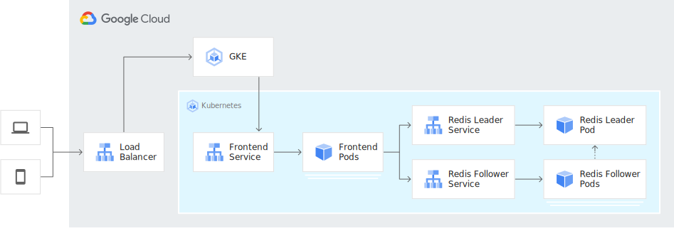

# Kubernetes Day 4Linux

1. [Kubernetes com piloto automático na Google Cloud](https://github.com/andersonbispos/4Linux-k8s-day/blob/main/tutorial/README.md#Kubernetes-com-piloto-automático-na-Google-Cloud "Kubernetes com piloto automático na Google Cloud")
1. [Configurando o Projeto](https://github.com/andersonbispos/4Linux-k8s-day/blob/main/tutorial/README.md#Configurando-o-Projeto "Configurando o Projeto")
1. [Implantando o livro de visitas com Redis e PHP](https://github.com/andersonbispos/4Linux-k8s-day/blob/main/tutorial/README.md#Implantando-o-livro-de-visitas-com-Redis-e-PHP "Implantando o livro de visitas com Redis e PHP")

## Kubernetes com piloto automático na Google Cloud

O Autopilot do GKE é um modo de operação no GKE em que o Google gerencia a configuração do cluster, incluindo nós, escalonamento, segurança e outras configurações prévias. Os clusters do Autopilot são otimizados para executar a maioria das cargas de trabalho de produção e provisionar recursos de computação com base nos manifestos do Kubernetes. A configuração simplificada segue as práticas recomendadas e recomendações do GKE para configuração, escalonabilidade e segurança do cluster e da carga de trabalho.

O Google Cloud disponibiliza vários exemplos de aplicações e cargas de trabalho diversas que podem ser utilizadas para realizar testes de aplicação no GKE.

Para esse tutorial vamos utilizar o tutorial disponibilizado em [Tutorial GKE - Redis/PHP](https://cloud.google.com/kubernetes-engine/docs/tutorials/guestbook) com algumas adaptações.

Mais exemplos de cargas de trabalho para testes no GKE podem ser encontrados [aqui](https://cloud.google.com/kubernetes-engine/docs/samples) e [aqui](https://github.com/GoogleCloudPlatform/kubernetes-engine-samples)

### Conceitos Importantes:

- [Cluster AutoScaling](https://cloud.google.com/kubernetes-engine/docs/concepts/cluster-autoscaler?hl=pt-br) e [Horizontal Pod Autoscaling](https://kubernetes.io/docs/tasks/run-application/horizontal-pod-autoscale/)
- [Configuração Declarativa](https://kubernetes.io/docs/tasks/manage-kubernetes-objects/declarative-config) usando arquivos de manifestos YAML.
- [Deployments](https://kubernetes.io/docs/concepts/workloads/controllers/deployment), que são recursos do Kubernetes que determinam a configuração de um conjunto de pods replicados (links em inglês)
- [Services](https://kubernetes.io/docs/concepts/services-networking/service), para criar balanceadores de cargas internos e externos em um conjunto de pods.

### Objetivos:

Para implantar e executar o aplicativo de livro de visitas no GKE Auto Pilot:

1. Criar um cluster GKE Auto Pilot
1. Configurar o líder do Redis
1. Configurar dois seguidores do Redis
1. Configurar o front-end da Web do livro de visitas
1. Acesse o site do livro de visitas.
1. Amplie o front-end da Web do livro de visitas.
1. Configure o HPA para o front-end do livro de visitas.

Abaixo um exemplo da arquitetura do nosso exemplo:



## Configurando o Projeto

Você pode usar um projeto existente do Google Cloud Platform para este tutorial ou pode [criar um projeto](https://cloud.google.com/resource-manager/docs/creating-managing-projects#creating_a_project).

Abra o <walkthrough-editor-spotlight spotlightId="menu-terminal">terminal</walkthrough-editor-spotlight> e siga os passos abaixo:

### 1. Configure as variáveis de ambiente

No terminal, defina duas variáveis `PROJECT_ID` e `COMPUTE_ZONE`, caso ainda não as tenha configurado.

```bash
PROJECT_ID=meu-projeto
```
Substitua `meu-projeto` pelo seu [project id](https://support.google.com/cloud/answer/6158840).

```bash
COMPUTE_ZONE=soutamerica-east1-c
```
Substitua COMPUTE_ZONE pela zona onde você quer provisinar os recursos [compute zone](https://cloud.google.com/compute/docs/regions-zones#available), por exemplo: `soutamerica-east1-c`.

### 2. Defina o projeto e a zona padrão
```bash
gcloud config set project $PROJECT_ID
gcloud config set compute/zone $COMPUTE_ZONE
```

### 3. Ajuste a configuração de exibição dos outputs dos comandos

```bash
gcloud config set accessibility/screen_reader False
```

### 4. Habilite as APIs necessárias:

```bash
gcloud services enable container.googleapis.com
gcloud services enable artifactregistry.googleapis.com
```

Em seguida, vamos criar nosso cluster do GKE Auto Pilot.


## Criando um Cluster GKE Auto Pilot

Um cluster GKE consiste em pelo menos uma máquina de plano de controle de cluster e várias máquinas de trabalho chamadas nós. Os nós são [instâncias de máquina virtual (VM) do Compute Engine](https://cloud.google.com/compute/docs/instances) que executam os processos do Kubernetes necessários para torná-los parte do cluster.

No GKE AutoPilot toda a infraestrutura subjacente ao cluster Kubernetes é gerenciado pela Google Cloud. Você só precisa se preocupar em criar os arquivos de declaração do K8S e fazer a implantação da sua aplicação. Toda infra é gerenciada pelo google. Além disso você só paga pela CPU, pela memória e pelo armazenamento que as cargas de trabalho solicitarem enquanto são executadas no Autopilot do GKE Você não é cobrado pela capacidade não utilizada nos nós, porque o GKE gerencia os nós.

### 1. Criar um cluster GKE AutoPilot

Execute o comando abaixo em seu terminal para criar um cluster `k8s-day-cluster`:

```
gcloud container clusters create-auto --region=southamerica-east1 k8s-day-cluster
```

Pode levar vários minutos para concluir a criação do cluster.

#### 1.1. Listar clusters existentes no projeto

Você pode usar o comando abaixo para listar os clusters ativos na sua conta:

```
gcloud container clusters list
```

### 2. Obter as credenciais de autenticação

Depois da criação do cluster, você precisa obter credenciais de autenticação para interagir com o cluster.

```
gcloud container clusters get-credentials k8s-day-cluster
```

Este comando configura `kubectl` para usar o cluster que você criou.


Em seguida, vamos seguir para a implantação do aplicativo no cluster.

## Implantando o livro de visitas com Redis e PHP

Para esse tutorial, vamos implantar primeiro um cluster redis com dois seguidores e em seguida implantar uma aplicação PHP que fará uso desse cluster. 

Além de disponibilizar o aplicativo e validar o funcionamento do cluster **Auto Scaling** a medida que nossa aplicação damandar mais recursos. Vamos ver também como criar e testar um objeto HPA (Horizontal Pod AutoScaling) no GKE que escala automaticamente a quantidade de pods necessária para atender a nossa aplicação a depender de parâmetros como CPU e memória.

### Configurar o líder do Redis Redis

No aplicativo do livro de visitas, o Redis é usado para armazenar os dados. O aplicativo grava os dados em uma instância líder do Redis e lê os dados de várias instâncias de seguidores do Redis. A primeira etapa é implantar um líder do Redis.

Primeiro, clone os manifestos de amostra:

```
git clone -n https://github.com/andersonbispos/4Linux-k8s-day
```

Entre no repositorio e atualize baixando apenas os arquivos necessários:

```
cd 4linux-k8s-day
git checkout HEAD tutorial/manifests
```


```
kubectl create namespace 4linux
```

```
kubectl create namespace 4linux
```

gcloud artifacts locations list


gcloud artifacts repositories create repo-4linux \
   --repository-format=docker \
   --location=southamerica-east1 \
   --description="Docker repository"


git clone https://github.com/GoogleCloudPlatform/kubernetes-engine-samples

cd kubernetes-engine-samples/hello-app


gcloud services enable sourcerepo.googleapis.com

gcloud services enable artifactregistry.googleapis.com

gcloud services enable container.googleapis.com


kubectl run -i --tty load-generator --rm --image=busybox --restart=Never -- /bin/sh -c "while sleep 0.01; do wget -q -O- http://frontend; done"

kubectl get hpa cpu --watch


https://cloud.google.com/kubernetes-engine/docs/tutorials/hello-app#create_a_repository

https://github.com/GoogleCloudPlatform/kubernetes-engine-samples/tree/main/gke-stateful-mysql

https://github.com/GoogleCloudPlatform/kubernetes-engine-samples/tree/main/hello-app
